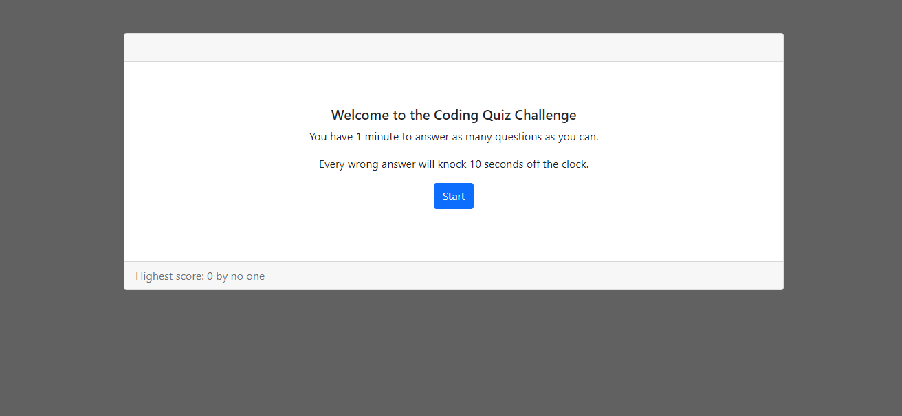

# Coding-Quiz - Module 4 Challenge

##Description

A quirky little quiz to test your coding knowledge
- The quiz starts with a timer set to 1 minute
- The timer starts counting down as soon as the first question is presented
- Each incorrect answer deducts 10 seconds from the clock
- The game ends when the timer reaches 0 or the questions run out
- The score is presented to the user
- If the score is the highest score achieved, the user is prompted for their initials
- The highscore and initials are displayed in the footer

##Usage

A fun game to test a user's coding knowledge.

##Credits

Bootstrap v5.1

##Screenshot

 
##Link to deployed application

https://mdpais.github.io/Coding-Quiz/

##License

None
